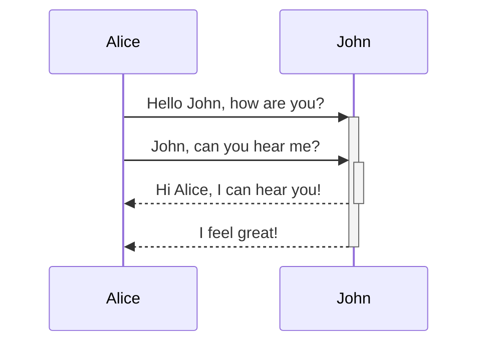
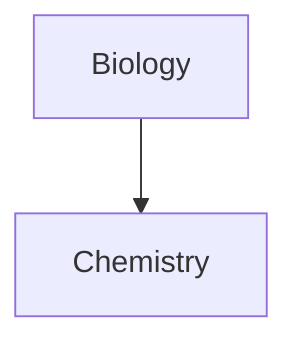

# Obsidian 基本用法
```ActivityHistory
/
```
## 基本用法
---
### 取消转义
---
Obsidian与$\TeX$类似，用很多特殊符号来格式化内容。如果想直接显示输入的字符，取消一切转义，就用\\（直接显示紧跟着的一个字符）或者\`...\`（取消所有\`之间的转义。

### 内部引用 Internal linking
---
如果想引用同一个仓库下的其他文章，可以直接用命令：
```md
Link to a page: [[Internal link]].
```
例如，如果我们想引用《笔记软件》这篇文章，就用命令：
```md
[[笔记软件]]
```
如果不想用原文章的名称，还可以自定义，在刚才的文件名后用 `| 新名称`即可。例如，
```md
[[笔记软件 | 软件介绍]]
```
就显示为：[[笔记软件 | 软件介绍]] [^linkshort]。

[^linkshort]: 实际上，`[[My page]]`是 `[My page](My page)`语法的缩写。

### 内嵌文件 Embeds
---

^c737f9

有时候我们不想引用文件的名称，而是直接将文件的内容显示在正文中，比如在正文中显示一幅图片，我们就可以用内嵌的方式。，我们可以命令： ^316729
```md
![[文件名]]
```
即在引用文件方式前加`!`。
例如，我们用如下命令引用一幅图片，
```md
![[创新升级香港论坛.jpg]]
```
![[创新升级香港论坛.jpg]]

还可以重新定义图片的尺寸，
```md
![[创新升级香港论坛 2.jpg]]
```
![[创新升级香港论坛 2.jpg]]

除了图片，我们还可以直接内嵌另一篇文章中的某一段。例如，用命令
```md
![[一瞬间的思考#Apr 03 2020]]
```
显示 ![[一瞬间的思考#Apr 03 2020]]

#### iframe
---
如果想内嵌一个网页，可以使用iframe语句。例如：
```html
<iframe src="https://www.youtube.com/embed/NnTvZWp5Q7o"></iframe>
```
<iframe src="https://www.youtube.com/embed/NnTvZWp5Q7o"></iframe>

### 标题级别 Headers
---
与通用Markdown语言一样，采用 `#，##，###`来设置一级、二级、三级标题。
```md
# This is a heading 1
## This is a heading 2
### This is a heading 3 
#### This is a heading 4
##### This is a heading 5
###### This is a heading 6
```
### 强调 Emphasis
---
英文中强调某一内容，一般用“加粗”和“斜体”两种方式 （可惜对于中文，这两种方式都显示不太好）。

源代码 | 显示效果
----------- | ------------
`*This text will be italic*`| *This text will be italic*
`_This text will be italic_` | _这部分文字 also be italic_
`**This text will be bold**` | **这部分文字 will be bold**
`__This text will be bold__` | __这部分文字 also be bold__

当然，这两种方式还可以嵌套使用。
```md
_You **can** combine them_
```
_You **can** combine them_

### 列表 Lists
---
直接用数字或者破折号，就可以标识为列表。如果还有层次，就用缩进方式。

```md
- Item 1
- Item 2
  - Item 2a
  - Item 2b

1. Item 1
1. Item 2
1. Item 3
   1. Item 3a
   1. Item 3b
```

- Item 1
- Item 2
  - Item 2a
  - Item 2b

1. Item 1
1. Item 2
1. Item 3
   1. Item 3a
   1. Item 3b

### 图片 Images
---
前面已经介绍过如何内嵌图片了（[[#内嵌文件 Embeds]]）。但如果想嵌入的是网络上图片，可以加上网络地址。例如，
```md

```
显示


### 链接 Links
---
#### 外部链接 External links
---
直接输入网址即可，当然，还可以重新定义名称：
```md
http://obsidian.md - automatic!
[Obsidian](http://obsidian.md)
```
显示为
http://obsidian.md - automatic!
[Obsidian](http://obsidian.md)

#### Obsidian URI 链接
---
如果想引用的文章，与本文不处于同一个仓库，则可以考虑使用Obsidian自己的地址引用（obsidian://）。原理与网络引用是一样的，只是语法稍微有点区别。
```md
[Link to note](obsidian://open?path=D:%2Fpath%2Fto%2Ffile.md)
```
也可以使用仓库名来代替路径，
```md
[Link to note](obsidian://open?vault=MainVault&file=MyNote.md)
```
用一个实际例子，
```md
[测试文件](obsidian://open?vault=test&file=test1.md)
```
[测试文件](obsidian://open?vault=test&file=test1.md)

#### 特殊情况
---
如果引用的地址里有空格，就要采取特殊处理方式：
1. 用`%20`代替空格
2. 用`<>`把有空格的内容都包起来

例如，
```md
[Export options](Pasted%20image)
```
和
```md
[Slides Demo](<Slides Demo>)
```
都可以显示有空格的地址。

### 块引述 Blockquotes
---
```md
> Human beings face ever more complex and urgent problems, and their effectiveness in dealing with these problems is a matter that is critical to the stability and continued progress of society.

\- Doug Engelbart, 1961
```


> Human beings face ever more complex and urgent problems, and their effectiveness in dealing with these problems is a matter that is critical to the stability and continued progress of society.

\- Doug Engelbart, 1961

### 行内代码 Inline code
---
用\`反引号包含起来的内容，可以直接在正文中直接使用，看起来就像是代码一样。例如，\`backticks\`显示出来就是`backticks`

### 代码块 Code blocks
---
如果是整块代码，需要独立显示，就可以用三个反引号，加上代码的属性即可。
<pre><code>```js
function fancyAlert(arg) {
  if(arg) {
    $.facebox({div:'#foo'})
  }
}
```</code></pre>
显示为，
```js
function fancyAlert(arg) {
  if(arg) {
    $.facebox({div:'#foo'})
  }
}
```
### 任务列表 Task list
---
```md
- [x] #tags, [links](), **formatting** supported
- [x] list syntax required (any unordered or ordered list supported)
- [x] this is a complete item
- [?] this is also a complete item (works with every character)
- [ ] this is an incomplete item
- [ ] tasks can be clicked in Preview to be checked off
```

- [x] #tags, [links](), **formatting** supported
- [x] list syntax required (any unordered or ordered list supported)
- [x] this is a complete item
- [?] this is also a complete item (works with every character)
- [ ] this is an incomplete item
- [ ] tasks can be clicked in Preview to be checked off

### 表格 Tables
---
\-短引号用来设置行，\|用来设置列，\:置于末尾的时候，用于对齐。
```md
First Header | Second Header
------------ | ------------
Content from cell 1 | Content from cell 2
Content in the first column | Content in the second column
```

First Header | Second Header
--------- | ---------
Content from cell 1 | Content from cell 2
Content in the first column | Content in the second column

### 删除线 Strikethrough 
---
```md
两个波浪号包含的内容 (like ~~this~~)。
```

两个波浪号包含的内容 (like ~~this~~)。

### 高亮显示 Highlighting
---
```md
两个等号包含的内容 ==highlight text==.
```

两个等号包含的内容  ==highlight text==.

### 脚注 Footnotes
---
```md
Here's a simple footnote,[^1] and here's a longer one.[^bignote]

[^1]: meaningful!

[^bignote]: Here's one with multiple paragraphs and code.

    Indent paragraphs to include them in the footnote.

    `{ my code }`

    Add as many paragraphs as you like.
```

Here's a simple footnote,[^1] and here's a longer one.[^bignote]

[^1]: meaningful!

[^bignote]: Here's one with multiple paragraphs and code.

    Indent paragraphs to include them in the footnote.

    `{ my code }`

    Add as many paragraphs as you like.
	
	---
	
### 数学公式 Math
---
和$\TeX$一样，行内公式用`$ ... $`包含，单独的公式，用`$$ ... $$`包含。

```md
$$\begin{vmatrix} a & b \\
c & d
\end{vmatrix}=ad-bc $$
```

$$\begin{vmatrix} a & b \\
c & d
\end{vmatrix}=ad-bc $$

### 评论 Comments
---
位于`%% ... %%`之内的都属于评论。

```md
Here is some inline comments: %%You can't see this text%% (Can't see it)

Here is a block comment:
%%
It can span
multiple lines
%%
```

Here is some inline comments: %%You can't see this text%% (can't see it in preview)

Here is a block comment: (can't see it in preview either)
%%
It can span
multiple lines
%%

### 图表 Diagram
---
Obsidian使用[Mermaind](https:mermaid-js.tighub.io/)来显示图表，可以参考学习资料[a helpful live editor](https://mermaid-js.github.io/mermaid-live-editor)。

<pre><code>```mermaid
sequenceDiagram
    Alice->>+John: Hello John, how are you?
    Alice->>+John: John, can you hear me?
    John-->>-Alice: Hi Alice, I can hear you!
    John-->>-Alice: I feel great!
```</code></pre>



````

````


